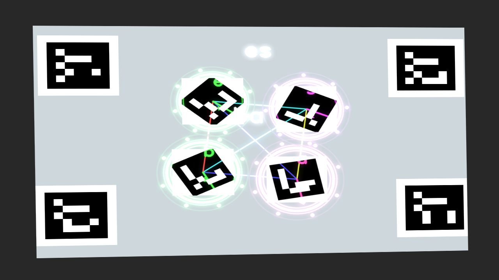
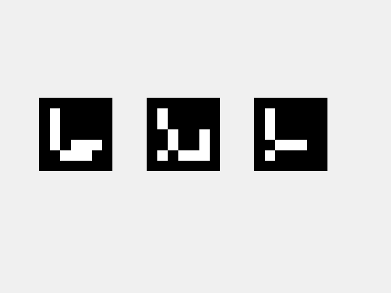
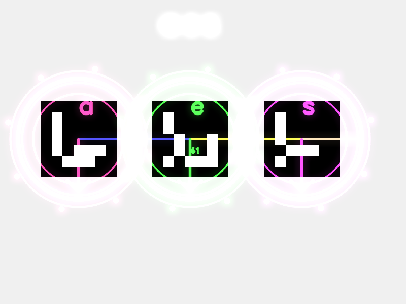

# projland

[](https://github.com/bddean/projland/actions/workflows/ci.yml)



*A frame from `projland snapshot`: synthetic camera observes 4 calibration
ArUco corners (untouched) plus 4 content markers wrapped in projected halos,
constellations, letter labels, and glow.*

Dynamic-land-style projector + webcam AR. Point a webcam and a projector at the
same flat surface; place printed ArUco markers on it; projland decorates them
with halos, labels, pulses, and constellations.

It auto-calibrates by projecting four ArUco fiducials at the projector's
corners and solving the projector→camera homography from where the camera
sees them.

The whole pipeline (detection, calibration, render, projection, observation)
also runs in a fully synthetic mode so it can be exercised headlessly with no
real hardware — see `tests/test_pipeline.py` and `projland demo`.

## Install

```bash
uv sync --extra dev
```

Requires Python 3.13 and a working camera + projector for the live app.
`opencv-contrib-python` brings in the ArUco module.

## Quick demo (no hardware)

Renders a 60-frame synthetic video that simulates the entire pipeline:

```bash
uv run projland demo -o demo.mp4 --frames 60
```

The synthetic camera observes printed markers on a virtual surface; projland
calibrates against four corner fiducials and projects decorations around the
content markers; the synthetic camera observes the lit-up surface and that's
the video frame.

## Try effects on your own image (no hardware)

If you have a photo of some printed ArUco markers from
`cv2.aruco.DICT_ARUCO_ORIGINAL`, run:

```bash
uv run projland test-image input.png -o output.png
```

Effects are composited directly on the image (identity calibration). Example:

| input | output |
| --- | --- |
|  |  |

## Pick a camera

`--camera` accepts either a USB index or a stream URL:

```bash
uv run projland run --camera 1
uv run projland run --camera http://192.168.1.245:8080/video
```

To see what's available:

```bash
uv run projland list-cameras --max 5
uv run projland list-cameras --url http://192.168.1.245:8080/video
```

(macOS will prompt for camera permission the first time.)

## Pick a projector display (macOS)

Install the macOS extra once so projland can read display info:

```bash
uv sync --extra dev --extra macos
```

Then:

```bash
uv run projland displays                          # list & guess which is the projector
uv run projland run                               # default: --projector auto
uv run projland run --projector 3                 # explicit display id
uv run projland run --projector off               # disable; drag window yourself
```

`auto` (the default) flags built-in vs external via Quartz's
`CGDisplayIsBuiltin` and picks the single non-built-in display. If you've got
the projector *and* an external monitor attached, it falls back to "the
non-main external".

## Live app

Plug in a webcam and a projector (treat the projector as a second display).
Then:

```bash
uv run projland run --projector-width 1280 --projector-height 800
```

Drag the `projland — projector` window onto the projector display.
Markers from `cv2.aruco.DICT_ARUCO_ORIGINAL` with IDs 200/201/202/203 are
reserved — projland projects those itself for calibration. Place any *other*
IDs as content markers.

Keys:

- `q` / Esc — quit
- `c` — recalibrate

## Print markers

```bash
uv run projland marker 7 --size 600 -o marker_7.png
uv run projland calibration-image -o calibration.png   # mostly for debugging
```

## Tests

```bash
uv run pytest
```

The synthetic harness (`projland.synthetic`) sets up a virtual flat surface
with two homography-distorted views (camera + projector). The pipeline test
asserts a halo drawn for a detected marker actually shows up centered on that
marker in the camera's view of the projection — i.e., the calibration is
correct end-to-end.

## Presets

Pick a scene preset for any of the rendering commands with `--preset`:

* `full` — every effect: trails, radar, constellations, halos, pulses,
  sparkles, orientation arrows, letter labels, spelled words, glow
* `minimal` — just halos and ID labels
* `spelling` — letter labels + spelled-word text
* `stars` — constellations + sparkles + heavy glow

Examples:

```bash
uv run projland snapshot --preset stars -o stars.png
uv run projland test-image input.png --preset minimal -o out.png
uv run projland run --preview --preset spelling
```

## Layout

- `projland.markers` — ArUco wrappers
- `projland.calibration` — projected-fiducial homography solver
- `projland.tracking` — EMA smoother for marker positions
- `projland.events` — debounced arrival/departure events
- `projland.letters` — ArUco-id → letter mapping (ported from your printed kit)
- `projland.spelling` — group letter markers into words
- `projland.render` — Scene/Renderer + composable Effects
- `projland.presets` — named scene builders
- `projland.synthetic` — virtual camera + projector for headless tests
- `projland.app` — live app loop
- `projland.cli` — `projland` CLI entry point
- `projland.demo_video` — synthetic end-to-end demo video writer
